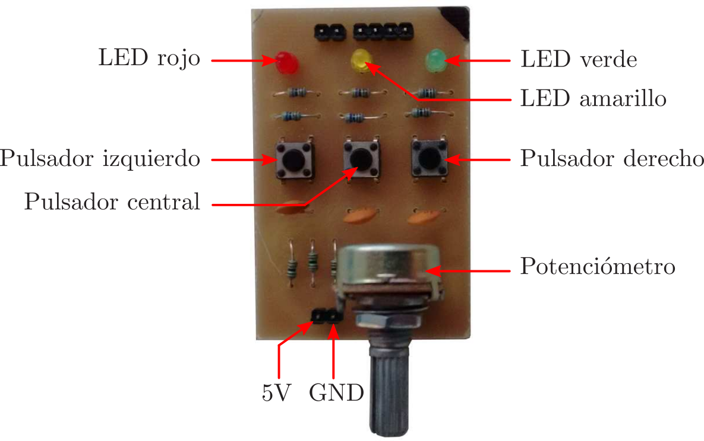

# Poncho (shield) para la placa Aruino UNO - ponchitoCIII

Gonzalo F. Perez Paina (CIII-UTN-FRC)

## Introducción
Las mayorı́a de las placas de desarrollos disponibles en el mercado cuentan con una variedad de placas adicionales que permiten expandir las funcionalidades básicas.
Estas placas reciben diferentes nombre tales como: placas de expansión o daughter board, shield –particularmente en el proyecto Arduino, etc.
La placa que se describe aquı́ sirve de expansión para Arduino UNO o con conexión compatible.

## Objetivo
El objetivo de la placa es contar con el hardware necesario para realizar las primeras prácticas en programación sobre sistemas embebidos.
Se puede utilizar para el desarrollo de software con los esquemas de sketch de Arduino (con placas Arduino UNO o equivalente), programación en lenguaje C de los microcontroladores AVR de las placas Arduino (sin el IDE Arduino).

## Descripción
El ponchitoCIII cuenta con componentes necesarios para evaluar el correcto funcionamiento de los primeros programa en Arduino, como ser: LEDS con los colores de semáforos (rojo, amarillo y verde), pulsadores, y potenciómetro como entrada al conversor analógico a digital.

A continuación se muestra el ponchitoCIII con los diferentes componentes; donde se indican los pines de alimentación (GND y Vin) que sirve como referencia para insertar esta placa en la placa madre Arduino.

<!--

-->

  

### Conexionado
La siguiente tabla muestra las conexiones de los diferentes componentes:

| Componente         | Pin Arduino          | Pin AVR    |
|:-------------------|----------------------|------------|
| LED verde          | 5                    | PD5        |
| LED amarillo       | 6                    | PD6        |
| LED rojo           | 9                    | PB1        |
| Pulsador izquierdo | 8                    | PB0        |
| Pulsador central   | 7                    | PD7        |
| Pulsador derecho   | 4                    | PD4        |
| Potenciómetro      | Entrada analógica A0 | PC0        |

## Agradecimientos
El diseño del circuito y del PCB, la fabricación de los PCB, el montaje y evaluación de las placas se llevó a cabo en el Laboratorio de Electrónica del Centro de Investigación en Informática para la Ingenierı́a (CIII) de la Facultad Regional Córdoba de la Universidad Tecnológica Nacional (UTN-FRC).
Gracias a Axel Schneider quien estuvo a cargo de la fabricación de los PCB, a Ariel Zsilavecz y Julio Sanchez, todos alumnos de la carrera de Ingenierı́a Electrónica en la UTN-FRC, quienes montaron y evaluaron el correcto funcionamiento de las placas, y a Facundo Navarro quien actualizó el diseño del PCB a la versión de KiCAD 5.0.
